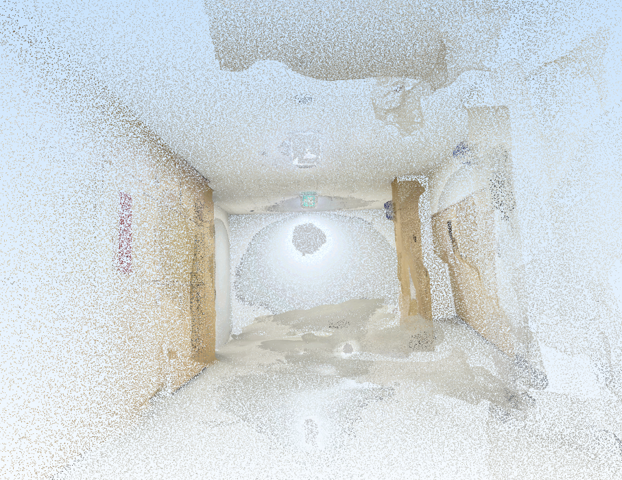
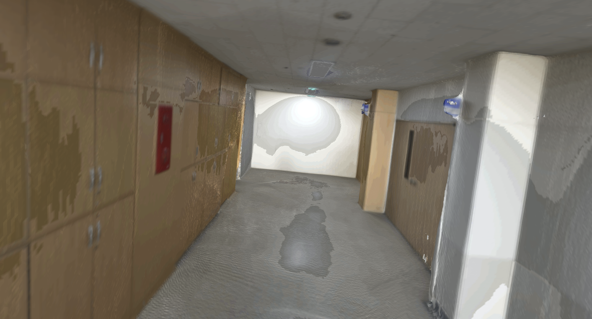
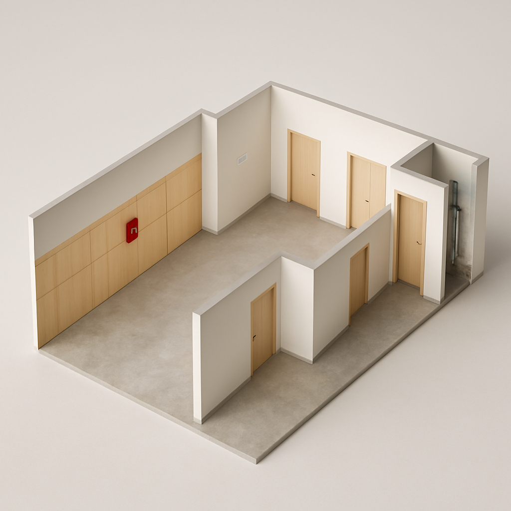
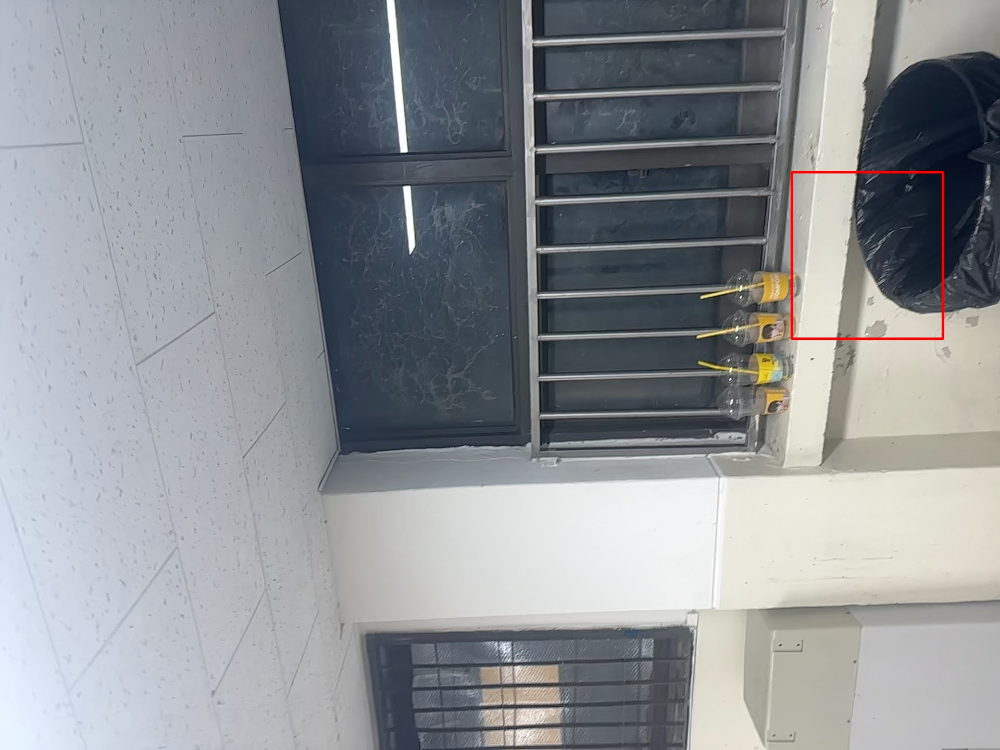
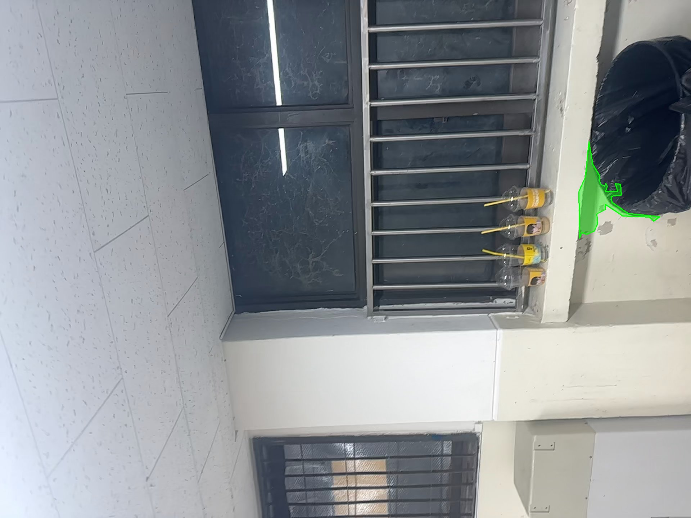
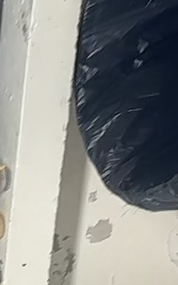

# 🏠 Team 404

**2026 동국대학교 정보통신공학과 졸업프로젝트 (DGU-ICE Capstone Design)**

---

## 📱 RoomLog

> 자취/원룸 거주자를 위한 **3D 방 기록 & 하자 관리 서비스**

LiDAR 기반 3D 스캔으로 입주 시점의 방을 기록하고, 퇴거 시 동일 공간을 다시 스캔해
**변경된 영역과 하자를 자동으로 비교·관리**할 수 있는 iOS 앱입니다.
하자 발견 시 주변 수리업체를 추천받아 견적 문의까지 한 번에 진행할 수 있습니다.

## 🎬 Demo

  <video src="https://github.com/user-attachments/assets/74cb89d5-8a08-4202-958b-5c00003a7694
" controls width="600"></video>

## 👥 Members

<table>
  <tr>
    <td align="center"><a href="https://github.com/ddodle"> <b>김도연</b></a></td>
    <td align="center"><a href="https://github.com/mnjese"> <b>김민지</b></a></td>
    <td align="center"><a href="https://github.com/ybkim453"> <b>김용빈</b></a></td>
    <td align="center"><a href="https://github.com/wk1717"> <b>송민교</b></a></td>
  </tr>
  <tr>
    <td align="center"><b>iOS</b></td>
    <td align="center"><b>Backend</b></td>
    <td align="center"><b>AI</b></td>
    <td align="center"><b>iOS</b></td>
  </tr>
  <tr>
    <td align="center">Auth · Home · Scan MyPage · Core</td>
    <td align="center">API Server Infra</td>
    <td align="center">3D Reconstruction Defect Detection</td>
    <td align="center">Viewer · Defect Comparison · Estimate</td>
  </tr>
</table>

## ✨ Features

<table>
  <tr>
    <td align="center" width="20%"><b>📡 스캔</b></td>
    <td align="center" width="20%"><b>🧊 3D 결과 확인</b></td>
    <td align="center" width="20%"><b>🔍 하자 탐지</b></td>
    <td align="center" width="20%"><b>🪞 내 방 비교</b></td>
    <td align="center" width="20%"><b>💰 업체 추천</b></td>
  </tr>
  <tr>
    <td align="center">
</td>
    <td align="center">
</td>
    <td align="center">
</td>
    <td align="center">
</td>
    <td align="center">
</td>
  </tr>
  <tr>
    <td align="center"><i>LiDAR로 방 내부를 3D로 녹화</i></td>
    <td align="center"><i>PLY 포인트클라우드 렌더링</i></td>
    <td align="center"><i>AI 기반 하자 위치 자동 태깅</i></td>
    <td align="center"><i>입주 전/퇴거 후 스캔 비교</i></td>
    <td align="center"><i>주변 수리업체 추천 견적 문의</i></td>
  </tr>
</table>

## Pipeline

### 🧊 3D 복원 파이프라인

LiDAR 스캔 데이터를 TSDF Fusion으로 메시화하고, GPT Image로 사실적인 썸네일을 생성합니다.

<table>
  <tr>
    <td align="center" width="33%"></td>
    <td align="center" width="33%"></td>
    <td align="center" width="33%"></td>
  </tr>
  <tr>
    <td align="center"><b>① PLY 포인트클라우드</b> 500k points 샘플링</td>
    <td align="center"><b>② TSDF 메시</b> Open3D ScalableTSDFVolume · voxel 1.5cm</td>
    <td align="center"><b>③ AI 썸네일</b> gpt-image-1 사실적 렌더</td>
  </tr>
</table>

### 🔍 AI 하자 탐지 파이프라인

GPT Vision으로 하자 영역을 검출하고, SAM 3 마스크로 정밀하게 세그멘테이션합니다.

<table>
  <tr>
    <td align="center" width="40%"></td>
    <td align="center" width="40%"></td>
    <td align="center" width="20%"></td>
  </tr>
  <tr>
    <td align="center"><b>① 하자 탐지 (bbox)</b> GPT Vision · 유형/심각도/면적</td>
    <td align="center"><b>② 정밀 마스크</b> SAM 3 · OpenCV contour</td>
    <td align="center"><b>③ 하자 디테일</b> 도장 박리 (PEELING)</td>
  </tr>
</table>

## 📦 Repositories

| Repository | Stack | 설명 |
|---|---|---|
| [**roomlog-ios**](https://github.com/DGU-Team404/roomlog-ios) | `Swift` `SwiftUI` `ARKit` | LiDAR 스캔 · 3D 뷰어 · 하자 관리 iOS 앱 |
| [**roomlog-server**](https://github.com/DGU-Team404/roomlog-server) | `Java` `Spring` | API 서버 · 스캔 데이터 처리 · 업체 추천 |
| [**roomlog-ai**](https://github.com/DGU-Team404/roomlog-ai) | `Python` | 포인트클라우드 재구성 · 하자 탐지 모델 |

## 🛠 Tech Stack

**iOS**

**Backend**

**AI**

**Collaboration**

